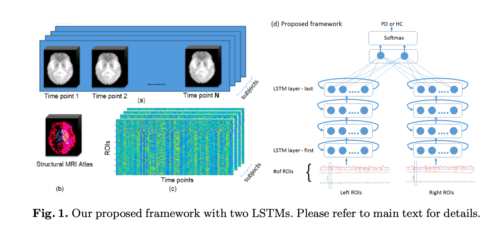

# PD
All steps below were implemented using the AFNI and SPM8 software packages. 
*A. Denoising:* Following standard protocol, we first performed pre-processing steps of despiking, slice-timing corrections, and isotropic-reslicing (3mm in each dimension) on the acquired fMRI data.
*B. Registrations:* We performed motion correction via rigid-body alignment to correct for any major head motion during the acquisition fMRI scan. We then rigidly registered each accompanying structural T1-weighted scan to the motion corrected fMRI volume, and non-linearly registered the transformed T1 scan to a structural MRI atlas (Fig. 1b) that was derived from 2 public atlases, namely, the Desikan-Killiany1 atlas that consists of 288 brain regions representing the cortex and the HMAT2 atlas that consists of 12 motor areas.
*C. ROI-calculations:* To reduce the amount of unwanted distortions intro- duced to our fMRI data, segmentation of each fMRI timepoint into anatomical brain regions was performed in the native space by transforming the segmenta- tions of the registered atlases to each fMRI timepoint using the set of transfor- mations obtained in the aforementioned registrations step.
*D. Smoothing:* The fMRI time courses of each position was next detrended; any linear or quadratic trends in the fMRI signal were removed. The time courses was then iteratively smoothed until it reached 6 FWHM of smoothness. Finally, bandpass-filtering was performed to ensure that the fMRI signals between the recommended frequencies of interest (0.01 Hz to 0.08Hz) are retained.
*E. Mean time course calculations:* The time courses at all positions within each ROI were then averaged to generate a mean time course per ROI. Each subject data is henceforth represented as a matrix of size R×T, where R is the number of ROIs and T is the number of time-points. Each input sequence spanned roughly 3 minutes of imaging as commonly done in the literature.

Full details can be found in our MLMI 2019 paper:
LSTMs and resting-state fMRI for classification and understanding of Parkinson’s disease.

### Proposed Model ###
we propose to separate the input data X into left and right data matrices as X_L and X_R 

The left and right LSTMs are independently trained in a cross-validation fashion and fine-tuned together in the second stage. M configurations of hyper- parameters are used to train a LSTM network and the optimal set is selected by computing the F1-score over a validation set. Based on literature survey as summarized in Table 1, we narrowed the search range of the key hyper- parameters and derived M = 12 configurations determined via grid search with learning rate (LR) set as one of {0.0001, 0.0025, 0.005}, with batch size (BS) set as one of {34, 68} and p as {0.7, 0.5}. Next, we performed fusion of the outputs from the 2 trained LSTMs by concatenating them with a fully-connected layer. 
